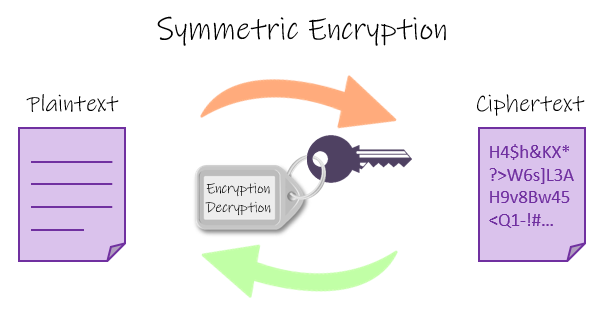

# Using Genetic Algorithms for decryption


### Introduction
I've always heard about genetic algorithms from various people and sources. There are a lot of excellent YouTube videos about it, but it has always sounded too complicated. I wanted to learn how to implement such an algorithm myself. I approached this like how I approach most problems; I used Google.

I read about different applications that sounded interesting to me. Many of the videos I've seen, use genetic algorithms in an advanced way, creating these objects that live in a physics environment. Coding all that seemed too time-intensive for a beginner like me. I wanted an application that would let me see how all the cogs mesh together and view some of the intricacies and benefits of this approach. I saw that it is often used for timekeeping and scheduling, neither of which sounded particularly interesting to develop as I don’t have any use cases to draw from. Then I found an application that piqued my interest: Decryption. 

I chose to program this using python as I am comfortable and quick utilizing it. It has plenty of library support if anything becomes necessary. 

### Landing on the Xor Cipher

It seemed challenging enough to see how the process functioned but simple enough to implement in a shorter time span. I decided on decrypting a xor cipher due to its simplicity. It is also an example of symmetric encryption, as the same key can be used to encrypt and decrypt the message. 


					
					Figure 1: Symmetric Encryption Illustration
				https://www.101computing.net/xor-encryption-algorithm/

Using the BitVector Library, coding the xor cipher was fairly simple. I started off by creating two functions that can read a key and a message from a file and create a BitVector object. 

```
def get_encryption_key(key_file_name="key.txt"):

   with open(key_file_name, "r") as fptr:
       key_str = fptr.read()

   key = BitVector(bitstring=key_str.strip())
   return key
```
```
def get_message(filename="input.txt"):
   with open(filename, "r") as fptr:
       mes_str = fptr.read()

   mes_str = mes_str.lower()
   message = BitVector(textstring=mes_str)

   return message

```

Then to implement the xor cipher, I iterated through the message by doing a bitwise xor with the key. If the message was shorter than the key, I just repeated the key. 

```
key_length = len(key)
mes_length = len(message)
key_pos = 0
out_encrypted = BitVector(size=mes_length)

for i in range(mes_length):
   out_encrypted[i] = message[i] ^ key[key_pos]
   key_pos += 1

   if key_pos >= key_length:
       key_pos = 0
```

Comparing it with other online tools, I saw that I was doing the xor cipher correctly. 

### Brute Force Decryption

As my goal is to do the decryption with genetic algorithms, I wanted to see how well my algorithm can fare against normal brute force decrypting.


	Figure 2: Brute Force Decryption: Total Time (sec) vs Number of Bits of Key

I found that using brute force decryption falls off heavily with the increase in key size. Once it reaches 35 bits, my Macbook would need almost *~* 4 years to decrypt the message. Extrapolating these results further shows that it would take roughly 6,469,812 *centuries* to decrypt a normal 64-bit key-encrypted message. 

### Genetic Decryption

So now that the simple brute force decryption is over, we move towards actually implementing the genetic algorithm. The first thing I need to do is to define a binary string representation of the problem to serve as a chromosome. For decryption, the binary key naturally plays this role. I began by creating a chromosome class that takes in a key and the encrypted message as arguments. Within this class, I decrypted the message using the key provided. 

```
class chromosome:
   def __init__(self, key, message):
       self.key = key

       self.decrypted = xor_encrypt(key, message)

       self.score = self.xor_find_fitness(self.decrypted)
```

The next important component of genetic algorithms is the fitness function. This is a function that determines how successful a chromosome is. In this context, it is how close the decrypted text matches the expected text. We give chromosomes that are closer to the actual key a higher value to separate them from lesser-performing chromosomes. 

```
def xor_find_fitness(self, decrypted):

       common = 0
       total = 0
       expected = get_message()

       decrypt_hex = BitVector(bitstring=decrypted)

       for i in range(len(expected)):

           if expected[i] == decrypted[i]:

               common += 1

           total += 1
           
       return common / total

```

Currently, we have a way to match any binary key with an appropriate score. We want to be able to test many of such chromosomes, so I found it useful to create a class called Population, that collects a group of chromosomes and can represent each generation

```
class population:

   def __init__(self, bit_size, bin_encrypted):

       self.bit_size = bit_size

       self.bin_encrypted = bin_encrypted

       self.individuals = []

       self.next_individuals = []

       self.elites = []

       self.children = []

       self.num_generations = 0
```

So now we have the setup complete, we can go through coding the actual algorithm. The first step is to create an initial population. I did this by starting off with chromosomes with randomized keys. 


	
					Figure 3: The key used for this 6-bit encryption


					Figure 4: The initial generation of chromosomes

If the key bit size is small enough, often times the random chromosomes can contain the key. The next step is to go into the main driving loop for our algorithm. The following steps are repeated with a new set of chromosomes for every generation until a key is found or the number of generations exceed the given limit. I didn’t want the program to keep going if it already found the key, so I had it check if it found a key so it can output the value of the key and the number of generations it took to find it. 

There are several strategies to employ for genetic algorithms. One of them is known as elitist selection. This entails taking a number of the best performing chromosomes and transferring them to the next generation unaltered. This strategy ensures that the overall solution quality would trend upwards from generation to generation. 


						Figure 5: Elite Selection Illustration

The next step is the crossover function, an analogue to genetic recombination. There are a variety of crossover methods that are typically utilized. One-point and two-point are the most commonly used methods. A single point crossover entails selecting a random point within the chromosome and swapping the left and right with another chromosome, forming a new child with characteristics from two parents. A two point crossover is similar but the chromosome is now cut twice and the three remaining pieces are swapped.


						Figure 6: One-Point Crossover
						


						Figure 7: Two-Point Crossover
						


					Figure 8: One-Point crossover implementation

The final step that I am implementing is mutation. Mutation in biology is a rare occurrence that happens in DNA during the transcription process. Mutations are normally deadly, but can offer certain individuals a population an advantage, causing the mutation to reproduce. Introducing some mutations can help create individuals that are closer to the desired chromosome. I implemented mutation as a 2% chance that a certain bit can flip from 1 to 0 or vice-versa. 


							Figure 9: Mutation Illustration
							
Then it goes through the same process again and again until a solution is found or the entered max generation number is reached. I saw a lot of good results in terms of timing improvement. Through genetic algorithms, decryption keys of 100 bits were reached in a matter of minutes, showing large improvements over the brute force method.  

### Practical Example

I show the entire process to decrypt a 6 bit key using the genetic algorithm. Elites selected from each generation are shown in blue. Mutations are shown in red. The sections that each parent contributes to their children is shown in purple and yellow. In order to find the key, the genetic algorithm took 3 generations in this instance of the run. Performance of the algorithm can vary run to run.


				Figure 10: Entire Genetic Algorithm Flow for 6 bit key
### Comparison of results
One advantage of the genetic decryption algorithm is that you can change parameters, such as the number of individuals per generation, the number of elites selected, and the number of max generations per your expected bit size to decrypt. This could reduce the overhead for smaller bit sizes resulting in a faster decryption time. To be consistent, I kept the same parameters for all values from 1-95. 

Looking at the following graphs, it is clear to see that the genetic algorithm is clearly superior to the brute force approach. 


	Figure 11: Total Combinations vs Number of Bits in Key for Brute Force Decryption
	


	Figure 12: Total Combinations vs Number of Bits in Key for Genetic Decryption


		Figure 13: Total Time vs Number of Bits in Key for Brute Force Decryption
	


		Figure 14: Total Time vs Number of Bits in Key for Genetic Decryption
### Dependencies Used
 * Bit-Vector 3.4.9

### Results
Can find the results used for the Genetic Algorithm Decryption [here](https://github.com/ybharatu/Genetic_algorithm_decryption/blob/main/results.txt)

### References

https://www.101computing.net/xor-encryption-algorithm/

https://www3.nd.edu/~busiforc/handouts/cryptography/letterfrequencies.html

https://www.google.com/amp/s/www.geeksforgeeks.org/xor-cipher/amp/

https://medium.com/pragmatic-programmers/breaking-codes-with-genetic-algorithms-f2c825e8bee1

https://engineering.purdue.edu/kak/dist/BitVector-3.4.9.html


[here](https://2048game.com/)
